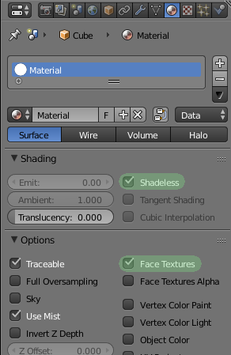

# Using glTF Models In AltspaceVR With Blender

This guide will walk you through the [glTF](https://github.com/KhronosGroup/glTF) asset creation pipeline, starting from model creation in [Blender](https://www.blender.org/), through export, conversion, and finally import into [AltspaceVR](https://altvr.com) via [Three.js](http://threejs.org/). This guide was written for the following software versions: Blender 2.77a, collada2gltf@d78daf1, and glTFLoader from Three.js r78.

glTF is unique as an interchange format. A model is expressed as two files: a `.gltf` file, which is JSON-formatted text describing the object hierarchy, materials, etc., and a `.bin` file, which is your binary geometry data. You need both to use the model. While it's also possible to embed the binary into the `.gltf` file, this is not recommended because it is not as efficient, though it's still more efficient than OBJ/MTL or Collada, so this is a personal choice.

* [Why use glTF?](#why)
* Step 1: [Export your model from Blender](#export)
* Step 2: [Convert your model into glTF](#convert)
* Step 3: [Load your model into Altspace](#load)
* [Resources](#resources)


## <a id="why"/>Why use glTF?

**TL;DR: It's faster at run time.**

1. It requires less processing.

	Most of the model formats you'll use for web-based 3d rendering, like OBJ/MTL and Collada, are text-based. This means that the number `0.678207` is being literally stored as the string `"0.678207"`, which has to be parsed into binary on load, then fed into the GPU for processing. By contrast, glTF stores all its geometry in a binary buffer from the beginning, so it can be fed directly into the GPU without additional parsing.

2. It produces a smaller model file, which means less bandwidth used and shorter load times.

	Another benefit of storing things in binary is compactness. Remember that number `0.678207` from before? Stored as a string, it looks like this in memory: `30 2e 36 37 38 32 30 37` (8 bytes). That same number in [binary](https://en.wikipedia.org/wiki/Single-precision_floating-point_format) looks like `3f 2d 9e f9` (only 4 bytes). Since each vertex in your model is stored as a minimum of three numbers like the above, that means you're saving at least 12 bytes per vertex, or 1.2MB on a 100k vertex model. After normals and UV coordinates, your typical savings will be 2-5 times larger than this minimum example, so that's a huge savings!
	

## <a id="export"/>Export your model from Blender

Geometry export is fairly straightforward with Blender, but it's quite common for the materials to not come through correctly. Follow the steps below, and your models will render as expected in Altspace right through the gate, so you don't need to apply materials, etc. in your code.

1. **Make sure you're using Blender Render.**
    Cycles is not well-supported right now with the various exporters, so even if you're doing your lighting/baking/etc. with Cycles, you'll still need to switch it back to Blender Render for export. Similarly, none of your materials can use shader nodes.

2. **Format materials.** For all the materials on the scene you're exporting, enable the *Shadeless* and *Face Textures* flags. These will prevent Blender from exporting a ton of material properties that Altspace won't use, and helps keep your final output files small.

    

3. **Double check your textures.** At this point, you can switch Blender's viewport shading mode to *Material*, and it will be drawn exactly as it will appear in Altspace. If it doesn't look right, make any changes necessary, rebake your lighting, and check again.

4. **Export model as Collada.** Once your model is ready to go,  select all the objects you want to export including children, and open up Blender's Collada exporter from *File* > *Export* > *Collada (.dae)*. Only these options should be checked: **Selection Only**, **Include Material Textures**, **Triangulate**, and **Use Object Instances**. If you have modifiers on your objects, also check **Apply Modifiers**.

5. **Fix texture references.** Blender has a tendency to use absolute paths to your textures, which won't work as URLs. Open up the `.dae` you just exported in a text editor, and search for "library_images". Change each path you see under the `<library_images>` section to a relative URL with respect to your model's path. So if your model is at `[folder]/models/model.dae`, a texture path of `[folder]/textures/texture.png` would become `../textures/texture.png`.

Once you've exported, I recommend loading the Collada version into Altspace to test. If you don't already have a test app, you can use the stub [A-Frame](https://aframe.io/) app listed in the [Resources](#resources) section. A-Frame is also an option for displaying your final glTF model, but that is not discussed in this guide.


## <a id="convert"/>Convert your model into glTF

Now we're going to take the Collada file you exported, and convert it to glTF. To do this, we'll need the `collada2gltf` tool found [here](https://github.com/KhronosGroup/glTF/releases). Get the latest build for your platform, and extract the archive somewhere you can get to it.

This tool is a command-line tool, so you'll need to run it from a terminal. Start the terminal ("cmd" on Windows, "Terminal" on OSX and Ubuntu), and run `collada2gltf` with `-k` for common materials, and `-f mymodel.dae` for the input file. It should look something like this:

```
C:\Users\username> c:\collada2gltf\collada2gltf.exe -k -f model.dae
converting:model.dae ... as model.gltf 
[geometry] 1134648 bytes
[animations] 0 bytes
[scene] total bytes:1134648
[completed conversion]
Runtime: 0.39 seconds
```

This will output the gltf/bin files to the same directory as the input file. You now have a valid glTF model, but we need to optimize it for Altspace. Open up the `.gltf` file in a text editor, and find/replace all instances of the word "PHONG" with "CONSTANT". Save the file.

The model will now load correctly in Altspace, but will still throw a bunch of warnings when loaded. If you don't care about warnings, or don't understand JSON, skip to the next section. Otherwise, we'll need to make some more changes. Open the `.gltf` file in your text editor again, and scroll down to the property `materials`. Under each material, delete the properties `ambient`, `emission`, `shininess`, and `specular`, so that only the property `diffuse` is left.


## <a id="load"/>Load your model into Altspace

Include the glTF Three.js loader in your code via a `<script>` tag in your HTML. You can get the loader [here](three-glTFLoader.js) or [here (minified)](three-glTFLoader.min.js). This code is compiled from a Three.js r78 example, and is already documented in the [Three.js SDK docs](http://threejs.org/docs/#Reference/Loaders/glTFLoader).

You then call the loader like this:

```javascript
var loader = new THREE.glTFLoader();
loader.load('YOUR URL HERE', function(gltf)
{
    // process model here

    scene.add( gltf.scene.children[0].children[0] );
});
```

The object passed into the callback is not a simple THREE.Object3D, it's a data structure containing several different things. To get the assembled model object, what you usually want is `gltf.scene.children[0].children[0]`. This strips away two layers of "top-level" objects, and leaves you with just what was exported. Test it with your own app, or use the previewer in the [Resources](#resources) section below.


## <a id="resources"/>Resources

### A-Frame Collada Previewer

```html
<html>
  <head>
    <title>A-Frame Collada Previewer</title>
    <script src="https://aframe.io/releases/0.2.0/aframe.min.js"></script>
    <script src="https://cdn.rawgit.com/AltspaceVR/aframe-altspace-component/v0.2.2/dist/aframe-altspace-component.min.js"></script>
  </head>
  <body>
    <a-scene altspace="usePixelScale: false" scale="1 1 1">
      <a-assets>
        <a-asset-item id="test" src="YOUR URL HERE"></a-asset-item>
      </a-assets>
      <a-collada-model src="#test" position="0 0 0" rotation="0 0 0" scale="1 1 1"></a-collada-model>
    </a-scene>
  </body>
</html>
```

### Three.js glTF Previewer

```html
<html>
	<head>
		<title>glTF Test</title>
		<script src='https://cdnjs.cloudflare.com/ajax/libs/three.js/r74/three.js'></script>
		<script src='three-glTFLoader.js'></script>
	</head>
	<body>
		<script>
		var scene = new THREE.Scene();

		if(altspace && altspace.inClient){
			var renderer = altspace.getThreeJSRenderer();
		}
		else {
			var renderer = new THREE.WebGLRenderer();
			renderer.setSize(1024, 1024);
			renderer.setClearColor( 0x808080 );
			document.body.appendChild(renderer.domElement);

			var camera = new THREE.OrthographicCamera(-1.5, 1.5, 1.5, -1.5, 0.1, 100);
			camera.up.set(0,0,1);
			camera.position.set(4, 0, 1.5);
			camera.lookAt(new THREE.Vector3(0, 0, 1.5));
			scene.add(camera);
		}

		var loader = new THREE.glTFLoader();
		loader.load('YOUR URL HERE', function(result)
		{
			var model = result.scene.children[0].children[0];
			scene.add(model);
		});

		window.requestAnimationFrame(function animate(dv){
			window.requestAnimationFrame(animate);
			renderer.render(scene, camera);
		});

		</script>
	</body>
</html>
```
